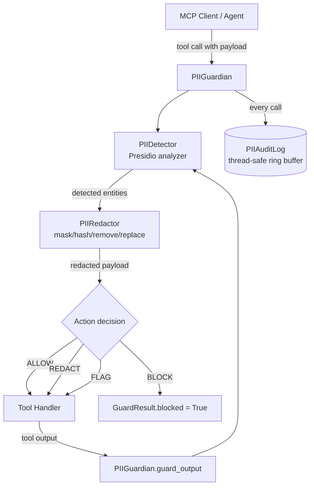

# mcp-server-pii-guardian

[](https://github.com/aumos-ai/mcp-server-pii-guardian)
[](https://pypi.org/project/mcp-pii-guardian/)
[](https://pypi.org/project/mcp-pii-guardian/)
[](LICENSE)

PII detection and redaction middleware for MCP servers.

Wraps [Microsoft Presidio](https://microsoft.github.io/presidio/) to give
any MCP tool server a clean, typed, zero-dependency guard layer that
detects, redacts, flags, or blocks personally identifiable information
before it leaks out of — or into — your tool calls.

---

## Why Does This Exist?

### The Problem — From First Principles

AI agents make tool calls. Tool calls carry payloads — user messages, search
queries, document fragments, database records. Those payloads routinely contain
personally identifiable information: names, email addresses, phone numbers, SSNs,
credit card numbers.

The typical approach to PII protection is to add checks inside each tool handler:
"before we write to the database, strip emails." This works for one tool. It
does not scale to ten, to fifty, or to an ecosystem where tools are added by
third parties. Every new tool is a new opportunity to forget the check. Every
new developer is a new opportunity to do it wrong.

The root cause is that PII protection is being applied at the application layer,
where it competes with business logic, rather than at the protocol layer, where
it can be applied uniformly to all traffic.

### The Analogy — A Mail Room That Screens Documents

A large organization's mail room screens incoming and outgoing correspondence
before it reaches staff or leaves the building. Individual employees don't need
to know the screening rules — they just send and receive. The mail room applies
the policy once, consistently, and logs what it found.

`mcp-server-pii-guardian` is that mail room for your MCP server. It sits between
the MCP protocol layer and your tool handlers. Every payload — in and out — passes
through the guardian. Tool handlers remain focused on their purpose. PII protection
is centralized, consistent, and auditable.

### What Happens Without This

Without a protocol-layer PII guard, MCP deployments typically:

- Rely on application-level checks that vary in quality across tool handlers
- Send raw user data — including PII — directly to LLMs without redaction
- Have no systematic record of what PII was present, detected, or blocked
- Cannot enforce consistent policy across tools added by different developers

`mcp-server-pii-guardian` moves PII protection to the one place it belongs: the
protocol layer, applied to all tool traffic, before any handler runs.

---

## Features

- Four redaction strategies: **MASK**, **HASH**, **REMOVE**, **REPLACE**
- Seven default entity types (email, phone, SSN, credit card, person, location, IP)
- Per-tool action overrides (`BLOCK`, `REDACT`, `FLAG`, `ALLOW`)
- Hard-block list for high-risk entity types (`US_SSN`, `CREDIT_CARD` by default)
- Thread-safe in-memory audit log with JSONL export
- Three built-in config presets: `default()`, `strict()`, `permissive()`
- `py.typed` — full type hint coverage, mypy strict compatible
- Extensible: plug in custom Presidio `PatternRecognizer` instances
- Zero AumOS dependencies — works with any MCP server framework

---

## Installation

```bash
pip install mcp-pii-guardian
python -m spacy download en_core_web_lg
```

Python 3.10+ is required.

---

## Quick Start

### Prerequisites

- Python 3.10+
- spaCy English model (`en_core_web_lg`) for named entity recognition

### Minimal Working Example

```python
from pii_guardian import PIIGuardian

guardian = PIIGuardian()

result = guardian.guard_input(
    tool_name="send_email",
    input_data={
        "to": "alice@example.com",
        "body": "Your SSN 123-45-6789 has been verified.",
    },
)

if result.blocked:
    raise ValueError("Request contains blocked PII")

print(result.data)
# {"to": "a***e@e******.com", "body": "Your SSN [REDACTED] has been verified."}
```

**Expected output:**
```
ValueError: Request contains blocked PII
```

### What Just Happened?

The guardian ran PII detection across all string values in the payload. It found
two entities:

1. `alice@example.com` — an `EMAIL_ADDRESS`. The default action is `REDACT`
   using the `MASK` strategy, which obscures the value while preserving its
   shape.
2. `123-45-6789` — a `US_SSN`. The default hard-block list includes `US_SSN`,
   so the entire request was blocked before any redaction occurred.

Because `result.blocked` is `True`, a `ValueError` is raised and the tool
handler never runs. No SSN reached the LLM, the tool, or any downstream system.

To see the masked email behavior without the block, use `GuardianConfig.permissive()`
or remove `US_SSN` from the `blocked_entities` list.

---

## Architecture Overview



**Key internal modules:**

| Module | Responsibility |
|---|---|
| `PIIDetector` | Wraps Presidio analyzer; deduplicates overlapping entity spans |
| `PIIRedactor` | Applies mask/hash/remove/replace strategies; right-to-left span replacement |
| `PIIAuditLog` | Thread-safe append-only ring buffer with JSONL export |
| `PIIGuardian` | Public API — orchestrates detector, redactor, and audit log |

---

## Configuration Presets

```python
from pii_guardian import GuardianConfig, PIIGuardian

# Default: MASK + REDACT, SSN and credit card always blocked
guardian = PIIGuardian(GuardianConfig.default())

# Strict: everything BLOCKED at 0.5 confidence threshold
guardian = PIIGuardian(GuardianConfig.strict())

# Permissive: FLAG only, never modify payloads (baselining / observation)
guardian = PIIGuardian(GuardianConfig.permissive())
```

---

## Custom Configuration

```python
from pii_guardian import GuardianConfig, PIIAction, PIIGuardian, RedactionStrategy

config = GuardianConfig(
    entities=["EMAIL_ADDRESS", "PHONE_NUMBER", "PERSON", "US_SSN"],
    threshold=0.75,
    redaction_strategy=RedactionStrategy.REPLACE,   # → [EMAIL_ADDRESS]
    default_action=PIIAction.REDACT,
    tool_actions={
        "internal_audit_tool": PIIAction.ALLOW,     # fully trusted tool
        "public_webhook":      PIIAction.BLOCK,     # zero tolerance
    },
    blocked_entities=["US_SSN"],
)
guardian = PIIGuardian(config, raise_on_block=False)
```

---

## MCP Middleware Pattern

```python
from pii_guardian import PIIGuardian, GuardianConfig

guardian = PIIGuardian(GuardianConfig.default())

def call_tool(tool_name: str, arguments: dict) -> dict:
    # 1. Guard input
    input_result = guardian.guard_input(tool_name, arguments)
    if input_result.blocked:
        return {"error": "Blocked: PII detected in arguments"}

    # 2. Execute tool with (possibly redacted) arguments
    raw_output = execute_tool(tool_name, input_result.data)

    # 3. Guard output
    output_result = guardian.guard_output(tool_name, raw_output)
    if output_result.blocked:
        return {"error": "Blocked: PII detected in tool result"}

    return output_result.data
```

See `examples/mcp_middleware.py` for a complete framework-agnostic example.

---

## Redaction Strategies

| Strategy  | Example output              | Use case                              |
|-----------|-----------------------------|---------------------------------------|
| `MASK`    | `a***e@e****e.com`          | Logs — preserve shape, hide value     |
| `HASH`    | `[HASH:3d7e2b1a9f805c24]`   | Pseudonymisation with reversibility   |
| `REMOVE`  | `[REDACTED]`                | Maximum anonymisation                 |
| `REPLACE` | `[EMAIL_ADDRESS]`           | NLP pipelines that need entity labels |

---

## Audit Log

```python
# Statistics
stats = guardian.audit_stats()
# {"total_events": 42, "by_action": {"redact": 38, "block": 4}, ...}

# Export as JSONL for SIEM ingestion
jsonl = guardian.export_audit_jsonl()

# Query specific entries
entries = guardian.audit_log.query(
    tool_name="send_email",
    entity_type="EMAIL_ADDRESS",
)
```

---

## Custom Entity Types

```python
from presidio_analyzer import Pattern, PatternRecognizer
from pii_guardian import GuardianConfig, PIIDetector, PIIGuardian

# Register a custom recogniser (e.g. internal employee ID format)
detector = PIIDetector(entities=["EMAIL_ADDRESS", "EMPLOYEE_ID"])
detector._engine.registry.add_recognizer(
    PatternRecognizer(
        supported_entity="EMPLOYEE_ID",
        patterns=[Pattern("emp", r"\bEMP-\d{6}\b", score=0.95)],
    )
)

guardian = PIIGuardian(GuardianConfig(entities=["EMAIL_ADDRESS", "EMPLOYEE_ID"]))
guardian._detector = detector
```

See `examples/custom_entities.py` for a complete example.

---

## Who Is This For?

**Developers** building MCP tool servers who need systematic PII protection
without adding detection logic to every tool handler.

**Enterprise teams** handling regulated data (GDPR, HIPAA, CCPA) who need a
protocol-layer PII control point with an auditable record of what was detected,
redacted, or blocked — across all tools, consistently.

This package works with any MCP server framework and has zero AumOS dependencies.
Drop it into any Python-based MCP deployment.

---

## Documentation

- [Quickstart](docs/quickstart.md)
- [Entity types reference](docs/entity-types.md)
- [Redaction strategies](docs/redaction-strategies.md)

---

## Related Projects

| Project | Description |
|---|---|
| [`mcp-server-trust-gate`](https://github.com/aumos-ai/mcp-server-trust-gate) | Trust-level and budget enforcement middleware for MCP (TypeScript) |
| [`a2a-trust-gate`](https://github.com/aumos-ai/a2a-trust-gate) | Governance middleware for Google A2A agent-to-agent traffic |
| [`aumos-core`](https://github.com/aumos-ai/aumos-core) | Core AumOS governance engine and AMGP protocol |
| [`aumos-integrations`](https://github.com/aumos-ai/aumos-integrations) | Pre-built integrations for LangChain, CrewAI, AutoGen |
| [AumOS Docs](https://github.com/aumos-ai/.github) | Centralized documentation and governance standards |

---

## Project Boundaries (FIRE LINE)

This project is intentionally narrow in scope. It will never include:

- AumOS or AMGP dependencies
- Role-based access control
- Persistent audit storage
- Cloud-provider SDK dependencies at runtime

See [FIRE_LINE.md](FIRE_LINE.md) for the full boundary definition.

---

## License

Apache 2.0 — see [LICENSE](./LICENSE).

Copyright (c) 2026 MuVeraAI Corporation.
